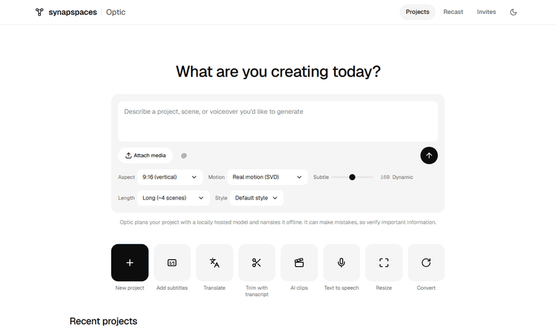

# Running the Synaps Optic editor



There are two ways to run the editor's front end. Pick the first one to work on the look of the
pages. Pick the second one to use the real editor with your own projects.

| | Preview only | Full editor |
|---|---|---|
| What you get | Every main page with sample data, clickable | The working app: uploads, timeline, renders |
| Needs | Python 3.11 | Python 3.11, ffmpeg, Docker, the Supabase CLI, all four repos |
| Setup time | About a minute | About 20 minutes the first time |

The live deployment is at https://video-editor-web.onrender.com/projects. It sleeps when idle, so the
first visit can take up to a minute.

## 1. Preview only (no backend)

The templates are plain Jinja2 files. `tools/preview.py` renders them with sample data, links the
pages to each other and stops the HTMX calls that would need a server.

```sh
git clone https://github.com/SynapSpaces/synaps-optic-frontend.git
cd synaps-optic-frontend
python -m venv .venv
.venv/Scripts/python -m pip install -e .[test]        # .venv/bin/python on macOS and Linux
.venv/Scripts/python tools/preview.py --serve
```

Open http://127.0.0.1:8765/projects.html. The moon or sun button in the top bar switches light and
dark mode; the page starts in your system's setting and remembers your choice. Edit a template under `optic_frontend/templates/`, run the
last command again and reload the page. The design rules are in [DESIGN.md](DESIGN.md), and the
tokens and fonts ship in `optic_frontend/static/ds/`. Dark mode is an app extension of those
tokens, defined in `base.html`: use the token classes (`text-fg-2`, `bg-surface-card`, `bg-ink`) and
both themes work; put `tone-light` on video and image wells so they stay dark in both.

Before you open a pull request, run the tests. They compile every template and check the package data.

```sh
.venv/Scripts/python -m pytest
```

### Browser tests (Playwright)

`tests/e2e/` opens the preview pages in Chromium and checks what a person would: every page loads
with the design system and no script errors, the nav and project cards link up, dark mode follows
the system and remembers the toggle, video stays dark, the editor's rail, tabs and tools respond, and
the Recast compare view loads frames (the backend calls are answered by a stub). CI runs it on every push.

```sh
.venv/Scripts/python -m pip install -e .[e2e]
.venv/Scripts/python -m playwright install chromium
.venv/Scripts/python -m pytest -m e2e                 # set E2E_HEADED=1 to watch it run
```

A failing test saves a screenshot to `e2e-artifacts/`. Plain `pytest` skips these tests.

To make a video of a run, like [e2e-run.mp4](e2e-run.mp4), record every test and join the clips with
captions (needs ffmpeg on `PATH`):

```sh
.venv/Scripts/python tools/e2e_video.py                  # writes e2e-artifacts/e2e-run.mp4
.venv/Scripts/python tools/e2e_video.py --slowmo 600 -k theme   # slower, dark-mode tests only
```

To refresh the GIF above after a visual change:

```sh
.venv/Scripts/python -m pip install playwright pillow
.venv/Scripts/python -m playwright install chromium
.venv/Scripts/python tools/record_gif.py              # writes docs/preview.gif
```

## 2. Full editor (backend, database and front end)

The editor is split into four repositories in the SynapSpaces organization. Only this one is public;
ask an organization owner for read access to the other three. Clone them side by side in one folder,
because the backend installs the other three from the sibling folders.

```sh
git clone https://github.com/SynapSpaces/synaps-optic-backend.git
git clone https://github.com/SynapSpaces/synaps-optic-frontend.git
git clone https://github.com/SynapSpaces/synaps-optic-database.git
git clone https://github.com/SynapSpaces/synaps-optic-context.git
```

You also need ffmpeg and ffprobe on your `PATH`, Docker Desktop running, and the Supabase CLI.

**Start the local database.** Run this from the database repo, where `supabase/config.toml` lives.
It prints the local API URL and keys.

```sh
cd synaps-optic-database
supabase start
```

**Configure the backend.** Copy the example settings and fill in the Supabase values that
`supabase start` printed. Set `OWNER_EMAIL` to the address you will sign in with.

```sh
cd ../synaps-optic-backend
cp .env.example .env.local
```

**Install and run.** The backend reads its settings from the environment, so load the file into the
shell first. The app creates its tables on the first start.

PowerShell:

```powershell
python -m venv .venv
.venv\Scripts\python -m pip install -r requirements-local.txt -r requirements-dev.txt
Get-Content .env.local | Where-Object { $_ -match '^[A-Z_]+=' } | ForEach-Object {
    $k, $v = $_ -split '=', 2; Set-Item "env:$k" $v }
.venv\Scripts\python run_app.py
```

macOS and Linux:

```sh
python -m venv .venv
.venv/bin/python -m pip install -r requirements-local.txt -r requirements-dev.txt
set -a; . ./.env.local; set +a
.venv/bin/python run_app.py
```

**Sign in.** Open http://127.0.0.1:8000, enter your `OWNER_EMAIL` and send the magic link. The local
stack does not send real email: open the Supabase mail inbox at http://127.0.0.1:54324 and click the
link there. You land on the projects page.

### What runs where

- The web app serves the pages and runs the CPU jobs: renders, analysis and transcripts.
- AI generation, scene animation and Recast run on a separate GPU agent. Without it the editor still
  works, and those jobs wait in the queue. Its setup is in the backend's `docs/GPU-AGENT-RUNBOOK.md`.
- The AI prompt on the home page needs a local LLM server (`LOCAL_LLM_URL` in `.env.local`). Without
  one, the prompt narrates your text directly.

### Troubleshooting

| Symptom | Fix |
|---|---|
| `ModuleNotFoundError: optic_frontend` | The four repos are not side by side, or `requirements-local.txt` was skipped |
| The app cannot reach the database | `supabase start` is not running, or `DATABASE_URL` does not match its output |
| The magic link says it expired | Request a new one; each link works once |
| Pages look unstyled | The page could not load `/static/ds/synapspaces.css` or the Tailwind CDN; check the browser console |
